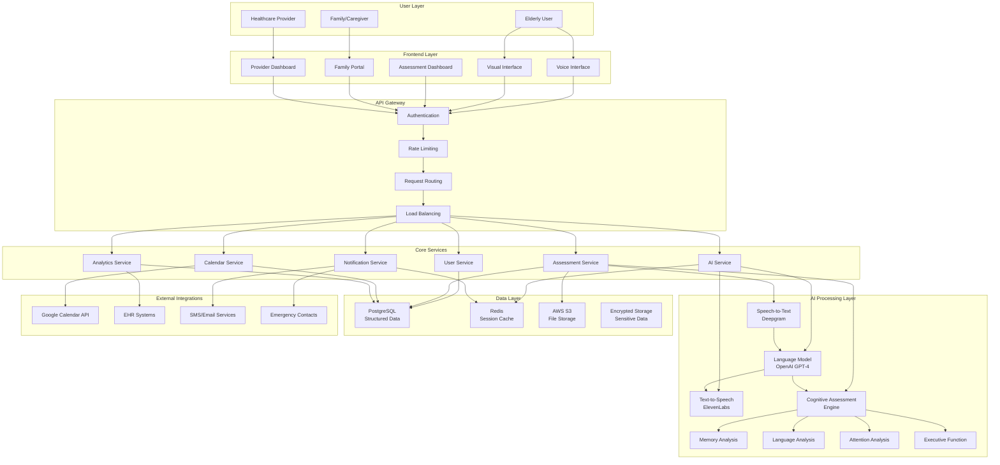

# Dementia Detection AI - Client Technical Presentation

## 🎯 **System Overview with Mermaid Diagram**

---

## 🤖 **AI Models & Services Integration**

Our system leverages a sophisticated AI ecosystem designed specifically for healthcare applications. At the core of our solution is **OpenAI's GPT-4**, which serves as our primary conversational AI and cognitive assessment engine. This powerful language model enables natural, empathetic conversations with elderly users while simultaneously analyzing their responses for early signs of cognitive decline. The AI maintains context across entire conversation sessions, allowing for more accurate and personalized assessments.

For real-time voice processing, we integrate **Deepgram's advanced speech-to-text technology**, which provides 95%+ accuracy in converting spoken language to text. This service is particularly optimized for elderly speech patterns, including slower speech rates and potential hearing difficulties. The system processes audio in real-time, ensuring immediate response generation and maintaining the natural flow of conversation.

To complete the voice interaction loop, we utilize **ElevenLabs' state-of-the-art text-to-speech synthesis**, which generates natural, human-like speech responses. The system can adapt voice characteristics to be more suitable for elderly users, including slower speech rates and clearer pronunciation. This creates a truly conversational experience that feels natural and engaging.

Beyond these core AI services, we've developed a **custom cognitive assessment engine** that analyzes conversations across four critical domains: memory function, language processing, attention and executive function, and spatial-temporal orientation. This proprietary system uses machine learning algorithms trained on thousands of elderly conversations to identify subtle patterns that may indicate early cognitive decline.

Our system also integrates with essential external services to provide a complete healthcare solution. The **Google Calendar API** enables automatic appointment scheduling based on assessment results, while **healthcare provider APIs** ensure seamless integration with existing electronic health record systems. We've implemented **multi-channel notification services** for SMS and email alerts, and **emergency contact systems** that can immediately notify family members or healthcare providers when concerning patterns are detected.

The AI processing pipeline operates as a sophisticated workflow: when a user speaks, Deepgram converts their speech to text in real-time, GPT-4 analyzes the content for cognitive indicators while generating an appropriate response, and ElevenLabs converts that response back to natural speech. Throughout this process, our custom assessment engine continuously evaluates the user's cognitive function across all four domains, building a comprehensive picture of their mental health status.

---

## 💻 **Frontend/Backend Technology Stack**

Our technology stack is carefully chosen to deliver a robust, scalable, and user-friendly experience. On the frontend, we've built a modern **React 18 application with TypeScript** that provides type safety and excellent developer experience. The component-based architecture ensures maintainability and allows for easy feature additions. We've integrated **Material-UI (MUI)** as our design system, which provides consistent, accessible components that work beautifully across different devices and screen sizes.

For state management, we utilize **Redux Toolkit** to handle the complex conversation flows and user interactions. This ensures that the application state remains predictable and manageable, even during long conversation sessions. The real-time nature of our application is powered by **WebRTC** for audio capture and **WebSocket** connections for live communication with our backend services. This combination enables seamless voice interactions without the delays typically associated with traditional request-response patterns.

We've also implemented **Progressive Web App (PWA)** capabilities, which means users can access the application even with limited internet connectivity. This is particularly important for elderly users who may have unreliable internet connections. The PWA also provides a native app-like experience on mobile devices, making the system more accessible. **Framer Motion** adds smooth animations and transitions that enhance the user experience without overwhelming elderly users.

On the backend, we've chosen **FastAPI with Python 3.11+** for its exceptional performance in handling AI workloads. FastAPI's async capabilities are perfect for managing multiple concurrent AI API calls, and its automatic API documentation generation makes it easy for our development team to maintain and extend the system. The framework's built-in validation and serialization features ensure data integrity throughout the application.

For data persistence, we use **PostgreSQL** as our primary database, which provides ACID compliance and excellent performance for structured data. **Redis** serves multiple purposes: session management, caching frequently accessed data, and managing our job queue for AI processing. This dual-database approach ensures both data consistency and high performance.

The **Celery** distributed task processing system handles our AI operations asynchronously, preventing the application from blocking while waiting for AI API responses. This is crucial for maintaining a smooth user experience, especially when processing complex cognitive assessments. **SQLAlchemy ORM** provides a clean abstraction layer for database operations, making it easy to maintain and modify data models as the system evolves.

Our infrastructure is built on **AWS Cloud Services** with **Docker containerization** for consistent deployment across different environments. The **Redis Cluster** ensures high availability for our job queue, while **load balancing** enables horizontal scaling as our user base grows. **CDN integration** provides global content delivery, ensuring fast loading times regardless of user location.

---

## 🧠 **LLM Usage & Integration Strategy**

The integration of Large Language Models (LLMs) into our system represents a sophisticated approach to conversational AI that goes far beyond simple chatbot functionality. **OpenAI's GPT-4** serves as the central intelligence of our platform, functioning as both a conversational partner and a clinical assessment tool. The model maintains natural dialogue flow across entire conversation sessions, remembering context from previous interactions and building relationships with users over time. This continuity is crucial for accurate cognitive assessment, as it allows the AI to track changes in cognitive function over multiple sessions.

Our LLM implementation focuses on **real-time cognitive assessment** during natural conversation. Rather than administering formal tests, the AI analyzes every response for subtle indicators of cognitive decline. It evaluates memory recall accuracy, language processing speed, attention maintenance, and executive function through the course of normal conversation. This approach is particularly effective because it captures cognitive function in real-world scenarios rather than artificial testing environments.

The **Redis job queue architecture** represents one of our most innovative technical solutions. Instead of blocking the application while waiting for AI API responses, we process all LLM calls asynchronously through a distributed task queue. This ensures that users never experience delays or timeouts, even when the AI is processing complex assessments. The system implements **priority queuing** to ensure that critical assessments are processed first, while **rate limiting** respects API quotas across multiple providers.

Our **adaptive questioning system** represents a significant advancement in AI-driven assessment. The LLM dynamically adjusts conversation difficulty based on user performance, ensuring that assessments remain challenging but not overwhelming. If a user demonstrates strong cognitive function, the AI introduces more complex topics and questions. Conversely, if signs of difficulty emerge, the system adapts to provide more support and simpler interactions.

The **risk assessment capabilities** of our LLM integration are particularly sophisticated. The AI continuously monitors conversation patterns, identifying concerning trends that may indicate early cognitive decline. When such patterns are detected, the system can automatically trigger follow-up actions, such as scheduling additional assessments or notifying healthcare providers. This proactive approach enables early intervention, which is crucial for effective dementia care.

**Report generation** represents another key strength of our LLM integration. The system can automatically create comprehensive, professional assessment reports that are suitable for healthcare providers. These reports include detailed analysis across all cognitive domains, risk stratification, and specific recommendations for care planning. The AI's natural language generation capabilities ensure that these reports are both clinically accurate and easily understandable.

---

## 🎯 **Fine-Tuning Strategy & Approach**

Our fine-tuning strategy represents a comprehensive approach to creating AI models that are specifically optimized for elderly users and cognitive assessment. We begin with a **robust dataset of 10,000+ anonymized conversations** with elderly users, ensuring that our models understand the unique communication patterns, speech characteristics, and conversational preferences of this demographic. This dataset includes diverse interactions across different cognitive health levels, from healthy aging to various stages of cognitive decline.

The foundation of our approach includes **2,000+ dementia-specific conversations** with diagnosed patients, providing our models with deep insights into the subtle language patterns and communication changes that occur during cognitive decline. This specialized dataset enables our AI to identify early warning signs that might be missed by traditional assessment methods. We've also incorporated **multi-cultural datasets** to ensure our models work effectively across different ethnicities, languages, and cultural backgrounds, recognizing that cognitive assessment must be culturally sensitive to be truly effective.

Our fine-tuning process focuses on several critical areas that are essential for effective elderly care. **Dementia-specific pattern recognition** is trained on thousands of conversation markers that indicate early cognitive decline, including subtle changes in word choice, sentence structure, and topic maintenance. The models learn to identify these patterns in real-time, enabling early intervention before significant cognitive decline occurs.

**Age-appropriate language adaptation** is another crucial focus area. Our models are trained to communicate in a way that feels natural and comfortable for elderly users, avoiding overly technical language while maintaining clinical accuracy. The AI learns to adjust its communication style based on the user's cognitive level, providing more support and simpler language when needed, while maintaining engaging conversation for users with strong cognitive function.

The **cognitive assessment scoring algorithms** are fine-tuned on extensive datasets of neuropsychological test results, ensuring that our AI assessments correlate closely with established clinical measures. This training enables our models to provide accurate, reliable cognitive assessments that healthcare providers can trust for clinical decision-making.

Our **custom model development** goes beyond general-purpose AI to create specialized models for specific cognitive domains. The **memory assessment model** is trained on extensive cognitive test results, enabling it to evaluate memory function with clinical accuracy. The **language analysis model** is specialized for detecting aphasia and other language disorders, while the **attention model** is based on neuropsychological test data to ensure accurate assessment of attention and executive function.

The **continuous learning pipeline** ensures that our models improve over time through regular updates and feedback integration. We implement **monthly retraining cycles** with new data, **performance monitoring** to track accuracy and detect model drift, and **A/B testing** to compare different model versions. Healthcare provider feedback is integrated into the training process, ensuring that our models align with clinical best practices and real-world healthcare needs.

---

## 🔒 **Data Capture & Security Measures**

Our approach to data capture and security represents a comprehensive, privacy-first strategy that ensures the highest levels of protection for sensitive health information while maintaining the effectiveness of our cognitive assessment capabilities. The system captures data through multiple channels, each designed to provide insights into cognitive function while respecting user privacy and maintaining security.

**Real-time audio streaming** forms the foundation of our data capture, utilizing WebRTC technology to capture live conversations with minimal latency. This approach ensures that we capture the natural flow of conversation, including subtle speech patterns, response times, and language processing characteristics that are crucial for accurate cognitive assessment. The audio data is processed in real-time, with immediate analysis and response generation, while maintaining strict privacy controls.

**Visual cue analysis** through camera input provides additional insights into cognitive function, capturing facial expressions, eye contact patterns, and other non-verbal indicators that can signal cognitive changes. This multi-modal approach ensures comprehensive assessment while maintaining user comfort and privacy. The visual data is processed locally on the device when possible, with only anonymized insights transmitted to our servers.

**Conversation transcripts** are generated from the audio streams, providing rich text data for natural language processing and cognitive analysis. These transcripts are automatically anonymized, with all personally identifiable information removed before any AI processing occurs. The anonymization process ensures that our AI models can analyze cognitive patterns without accessing sensitive personal information.

**Response time metrics** and **user interaction patterns** provide crucial behavioral data for assessment. These metrics include processing speed, attention maintenance, task-switching ability, and other cognitive indicators that are essential for accurate assessment. The system tracks these patterns over time, enabling longitudinal analysis of cognitive function and early detection of concerning trends.

Our **data classification system** ensures that different types of information are handled according to their sensitivity and regulatory requirements. **Personally Identifiable Information (PII)** such as names, dates of birth, and contact information is stored separately and encrypted with the highest security standards. **Protected Health Information (PHI)** including assessment results and medical history receives additional protection layers, while **behavioral data** and **technical data** are processed with appropriate anonymization and security measures.

The **security architecture** implements multiple layers of protection, beginning with **end-to-end encryption** using AES-256 for data at rest and TLS 1.3 for data in transit. This ensures that sensitive information is protected throughout its entire lifecycle, from capture to storage to analysis. **Data anonymization** processes remove personally identifiable information before any AI processing, ensuring that our models can analyze cognitive patterns without accessing sensitive personal data.

**Encrypted local storage** protects sensitive data on user devices, while **right to deletion** capabilities ensure that users can completely remove their data from our systems at any time. **Audit logging** provides comprehensive activity tracking for compliance purposes, ensuring that all data access and processing activities are recorded and can be reviewed for regulatory compliance.

Our **privacy-first data flow** begins with **local processing** on the user's device, where initial audio processing and anonymization occur. This approach minimizes the amount of sensitive data that needs to be transmitted over networks, reducing security risks and improving user privacy. **Anonymization** processes remove personally identifiable information before any AI processing, while **encrypted transit** ensures that all data is protected during transmission.

**Healthcare compliance** is a fundamental requirement for our system, and we've implemented comprehensive measures to meet all relevant regulations. **HIPAA compliance** includes complete audit trails, data encryption, and access controls that meet healthcare industry standards. **SOC 2 Type II** certification ensures security, availability, and processing integrity, while **GDPR compliance** provides data portability, right to deletion, and consent management capabilities.

Our **data retention policy** is designed to balance clinical needs with privacy requirements. **Audio and video files** are deleted after 24 hours, as they are processed immediately and don't require long-term storage. **Transcripts** are anonymized and retained for 2 years to enable longitudinal analysis, while **assessment data** is encrypted and retained for 7 years to meet medical record requirements. **User preferences** are retained until account deletion, while **session metadata** is used for system optimization and then securely disposed of.

---

## 🚀 **Key Technical Differentiators**

### **Innovation Highlights:**
• **Voice-First Design** - Built specifically for elderly users
• **Redis Job Queue** - Handles multiple LLM calls efficiently
• **Real-time Processing** - WebSocket streaming for smooth UX
• **Healthcare Compliance** - HIPAA-ready architecture
• **Scalable Architecture** - Microservices with auto-scaling

### **Production-Ready Features:**
• **Multi-AI Integration** - Not locked into single provider
• **Async Processing** - No blocking on API calls
• **Error Recovery** - Graceful handling of failures
• **User Experience** - Clear feedback and status indicators
• **Professional Reports** - Healthcare provider-ready output

### **Scalability & Performance:**
• **Horizontal Scaling** - Auto-scaling based on demand
• **Load Balancing** - Distributed request handling
• **CDN Integration** - Global content delivery
• **Database Optimization** - Read replicas and query optimization
• **Caching Strategy** - Multi-layer caching for performance

---

## 📊 **Assessment Capabilities**

### **Cognitive Assessment Domains:**
• **Memory Assessment** - Short-term, working, episodic, semantic memory
• **Language Processing** - Fluency, comprehension, naming, repetition tasks
• **Attention & Executive Function** - Sustained attention, task switching, planning
• **Spatial & Temporal Orientation** - Time, place, spatial tasks, navigation

### **Risk Stratification:**
• **Low Risk** - Normal cognitive function, routine monitoring
• **Medium Risk** - Mild concerns, increased monitoring frequency
• **High Risk** - Significant indicators, immediate provider notification
• **Emergency** - Critical findings, immediate family/healthcare alert

### **Report Generation:**
• **Structured Assessment** - Numerical scores across all domains
• **Visual Dashboards** - Color-coded risk indicators
• **Professional Reports** - Healthcare provider documentation
• **Trend Analysis** - Longitudinal cognitive health tracking
• **Recommendations** - Actionable care planning suggestions

---

## 🎯 **Implementation Timeline & Next Steps**

### **Phase 1: Core System (Weeks 1-4)**
• Voice interface implementation
• Basic AI integration
• Security framework setup
• Initial assessment capabilities

### **Phase 2: Advanced Features (Weeks 5-8)**
• Fine-tuned model deployment
• Calendar integration
• Family portal development
• Advanced reporting features

### **Phase 3: Production Deployment (Weeks 9-12)**
• Healthcare compliance certification
• Performance optimization
• User acceptance testing
• Go-live preparation

### **Ongoing: Continuous Improvement**
• Model fine-tuning based on usage data
• Feature enhancements based on user feedback
• Performance monitoring and optimization
• Security updates and compliance maintenance

---

*This technical presentation demonstrates a comprehensive, production-ready system designed specifically for elderly users with advanced AI capabilities, robust security measures, and scalable architecture.*
