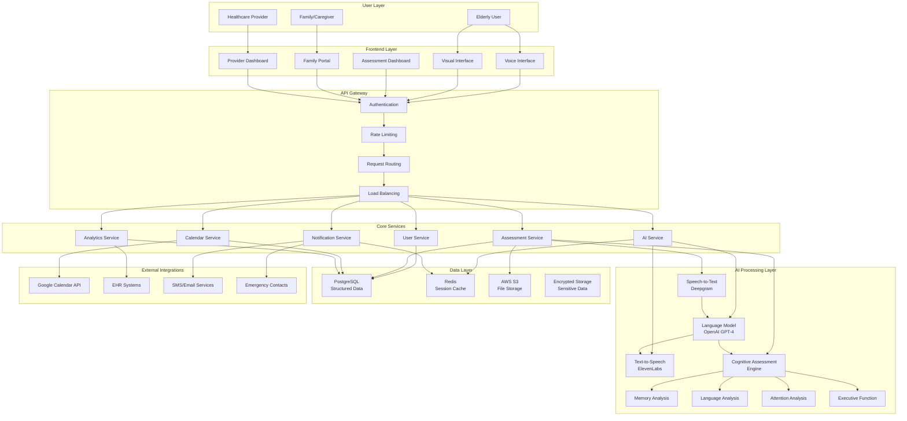
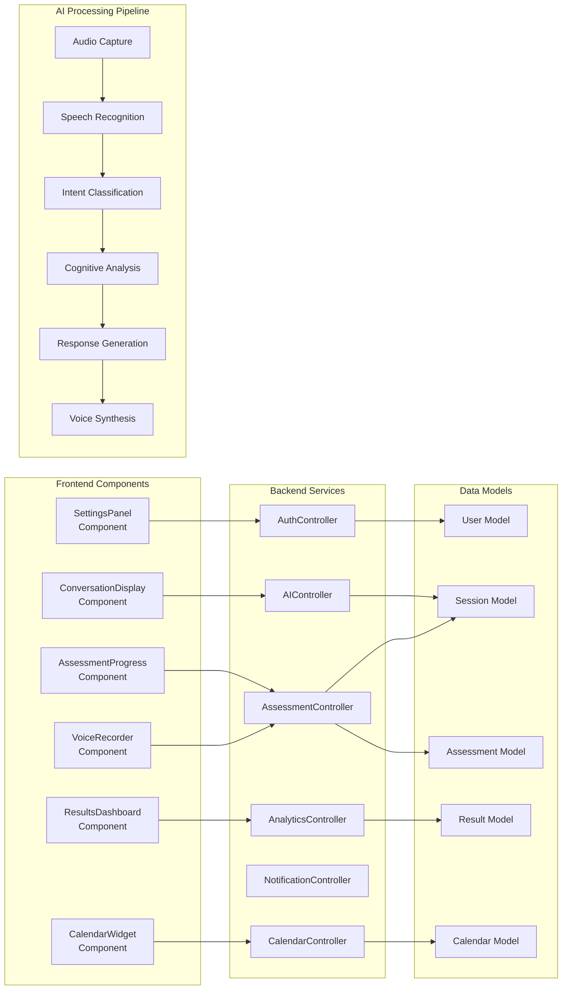
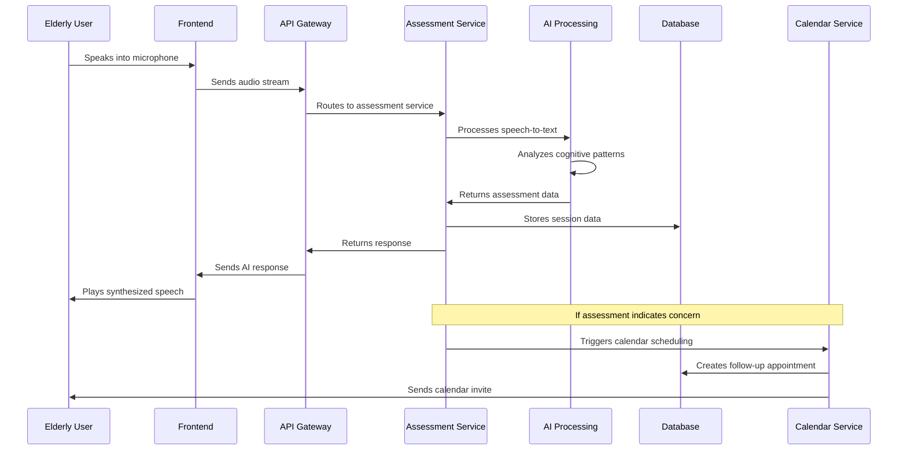
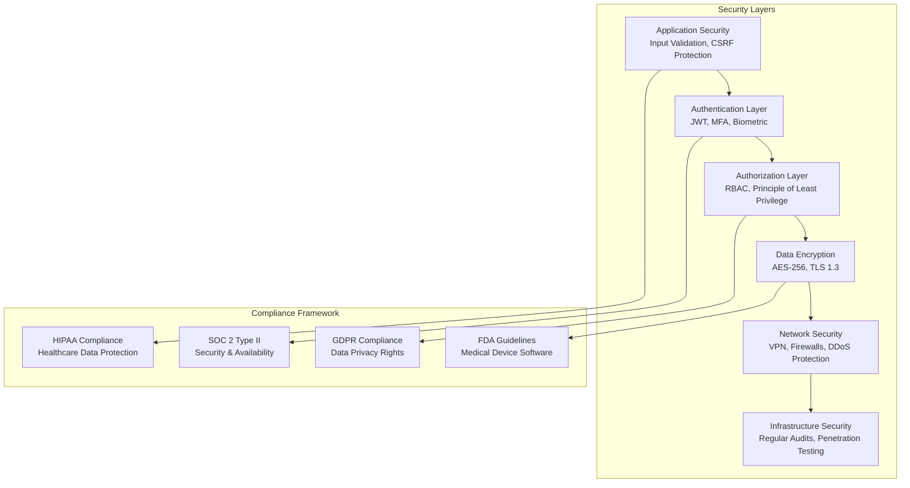
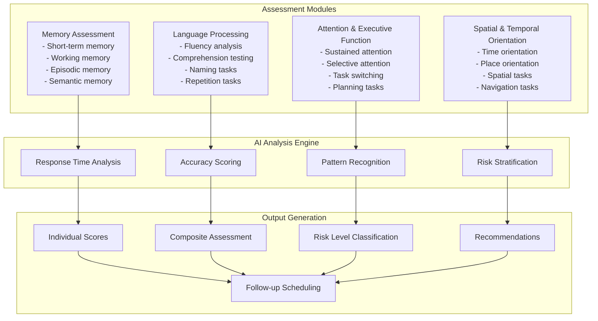
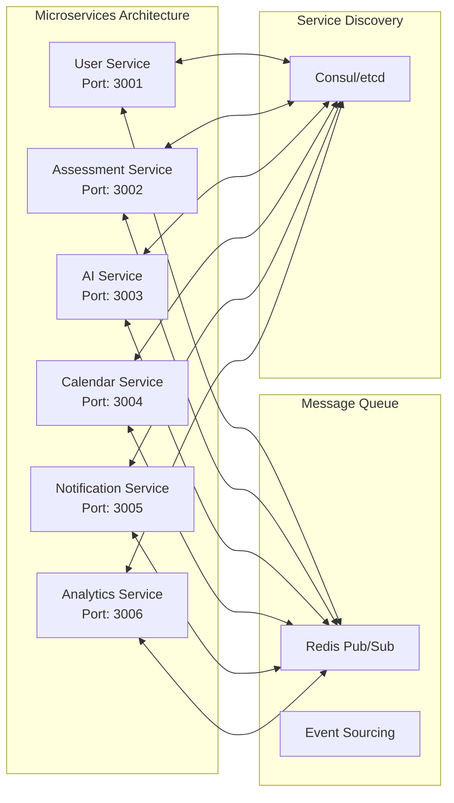

# Conversational AI for Early Dementia Detection - System Design Diagram

## High-Level System Architecture



## Detailed Component Architecture



## Data Flow Architecture



## Security Architecture



## Cognitive Assessment Architecture



## Deployment Architecture

```mermaid
graph TB
    subgraph "AWS Cloud Infrastructure"
        subgraph "Frontend Tier"
            FT1[CloudFront CDN]
            FT2[S3 Static Hosting]
            FT3[Lambda@Edge]
        end
        
        subgraph "Application Tier"
            AT1[ECS Fargate Cluster]
            AT2[Application Load Balancer]
            AT3[Auto Scaling Groups]
        end
        
        subgraph "Data Tier"
            DT1[RDS PostgreSQL<br/>Multi-AZ]
            DT2[ElastiCache Redis]
            DT3[S3 File Storage]
        end
        
        subgraph "AI Services Tier"
            AIT1[Lambda Functions]
            AIT2[API Gateway]
            AIT3[Step Functions]
        end
        
        subgraph "Monitoring & Security"
            MST1[CloudWatch]
            MST2[DataDog]
            MST3[GuardDuty]
            MST4[WAF]
        end
    end
    
    subgraph "External Services"
        ES1[OpenAI API]
        ES2[Deepgram API]
        ES3[ElevenLabs API]
        ES4[Google Calendar API]
    end
    
    FT1 --> AT2
    AT2 --> AT1
    AT1 --> DT1
    AT1 --> DT2
    AT1 --> DT3
    AT1 --> AIT1
    AIT1 --> ES1
    AIT1 --> ES2
    AIT1 --> ES3
    AT1 --> ES4
    
    AT1 --> MST1
    AT1 --> MST2
    AT1 --> MST3
    AT1 --> MST4
```

## Microservices Communication



## Key Architectural Decisions

### 1. **Voice-First Design**
- Primary interaction through natural speech
- Visual interface as supportive element
- Accessibility considerations for elderly users

### 2. **Privacy-First Architecture**
- Local audio processing where possible
- End-to-end encryption for sensitive data
- Granular consent management

### 3. **Modular AI Assessment**
- Separate engines for different cognitive domains
- Real-time analysis and scoring
- Adaptive questioning based on performance

### 4. **Healthcare Integration**
- FHIR API compliance for EHR integration
- Provider dashboard for monitoring
- Automated alert system for concerning results

### 5. **Scalable Microservices**
- Independent service scaling
- Event-driven architecture
- Container-based deployment

### 6. **Comprehensive Security**
- Multi-layer security approach
- Healthcare compliance (HIPAA, SOC 2)
- Regular security audits and testing

This architecture provides a robust, scalable, and secure foundation for the conversational AI system while maintaining the highest standards for healthcare data protection and user privacy.
